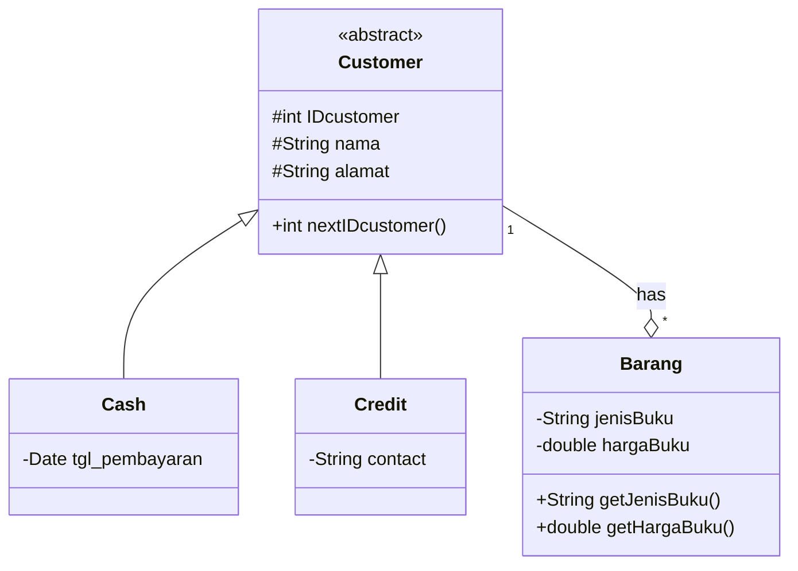
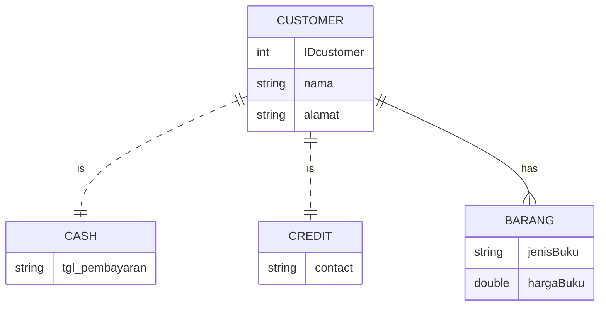
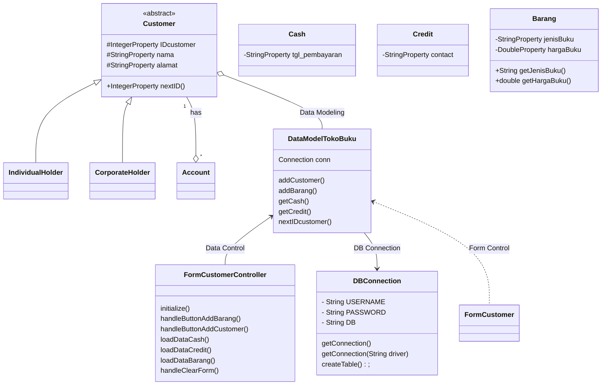

# Sistem Penjualan Toko Buku "SHEENA"

## Sistem ini menyediakan pelayanan untuk melakukan kegiatan transaksi jual-beli pada toko buku

### Class Diagram

### ER Diagram

### Design Class Diagram for JavaFX and Database

