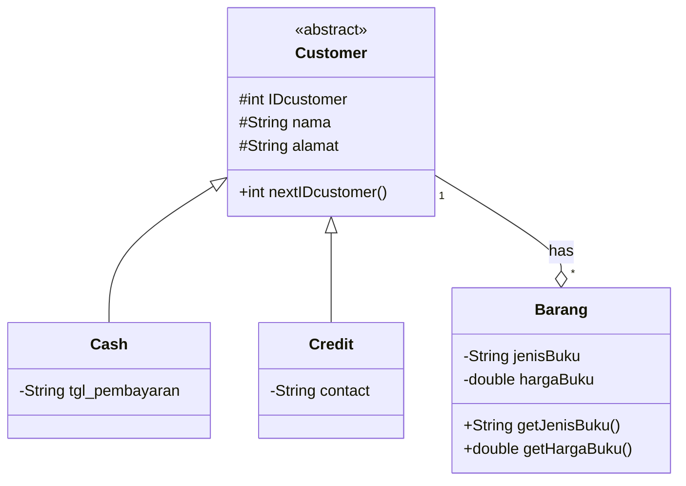
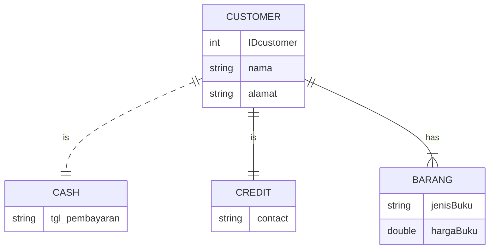
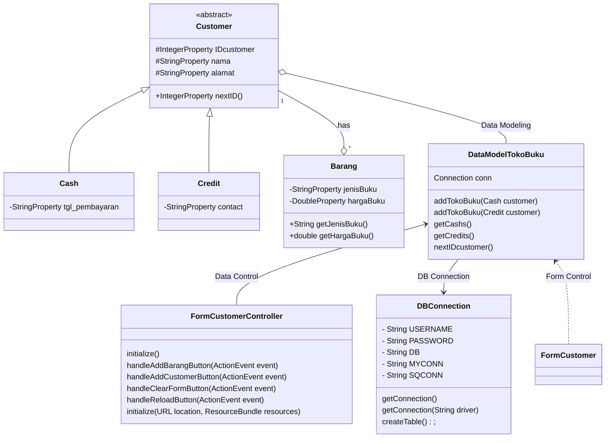

# Sistem Penjualan Toko Buku

## Sistem ini menyediakan pelayanan untuk 

### Class Diagram

```mermaid
classDiagram
    Customer <|-- Cash
    Customer <|-- Credit
    Customer "1"--o"*" Barang : has
    
    class Customer{
      <<abstract>>
      #int IDcustomer
      #String nama
      #String alamat
      +int nextIDcustomer()
    }
    
    class Cash{
      -String tgl_pembayaran
    }
    class Credit{
      -String contact
    }
    class Barang{
      -String jenisBuku
      -double hargaBuku
      +String getJenisBuku()
      +double getHargaBuku()
    }
            
```

### ER Diagram

```mermaid
erDiagram
          CUSTOMER ||..|| CASH : is
          CUSTOMER ||--|| CREDIT : is
          CUSTOMER ||--|{ BARANG: "has"
          CUSTOMER {
            int IDcustomer
            string nama
            string alamat
          }
          CASH{
            string tgl_pembayaran
          }
          CREDIT{
            string contact
          }
          BARANG{
            string jenisBuku
            double hargaBuku
          }
```
### Design Class Diagram for JavaFX and Database

```mermaid
classDiagram
    Customer <|-- Cash
    Customer <|-- Credit
    Customer "1"--o"*" Barang : has
    Customer o-- DataModelTokoBuku : Data Modeling
    DataModelTokoBuku <-- FormCustomerController : Data Control
    DataModelTokoBuku --> DBConnection : DB Connection
    DataModelTokoBuku <.. FormCustomer : Form Control      

    class Customer{
      <<abstract>>
      #IntegerProperty IDcustomer
      #StringProperty nama
      #StringProperty alamat
      
      +IntegerProperty nextID()
    }
    
    class Cash{
      -StringProperty tgl_pembayaran
    }
    class Credit{
      -StringProperty contact
    }
    class Barang{
      -StringProperty jenisBuku
      -DoubleProperty hargaBuku
      +String getJenisBuku()
      +double getHargaBuku()
    }

    class DataModelTokoBuku{
        Connection conn
        addTokoBuku(Cash customer)
        addTokoBuku(Credit customer)
        getCashs()
        getCredits()
        nextIDcustomer()
    }

    class FormCustomerController{
        initialize()
        handleAddBarangButton(ActionEvent event)
        handleAddCustomerButton(ActionEvent event)
        handleClearFormButton(ActionEvent event)
        handleReloadButton(ActionEvent event)
        initialize(URL location, ResourceBundle resources)
        
    }
    
    class DBConnection{
        - String USERNAME
        - String PASSWORD
        - String DB
        - String MYCONN
        - String SQCONN
        getConnection()
        getConnection(String driver)
        createTable();
    }
            
```
