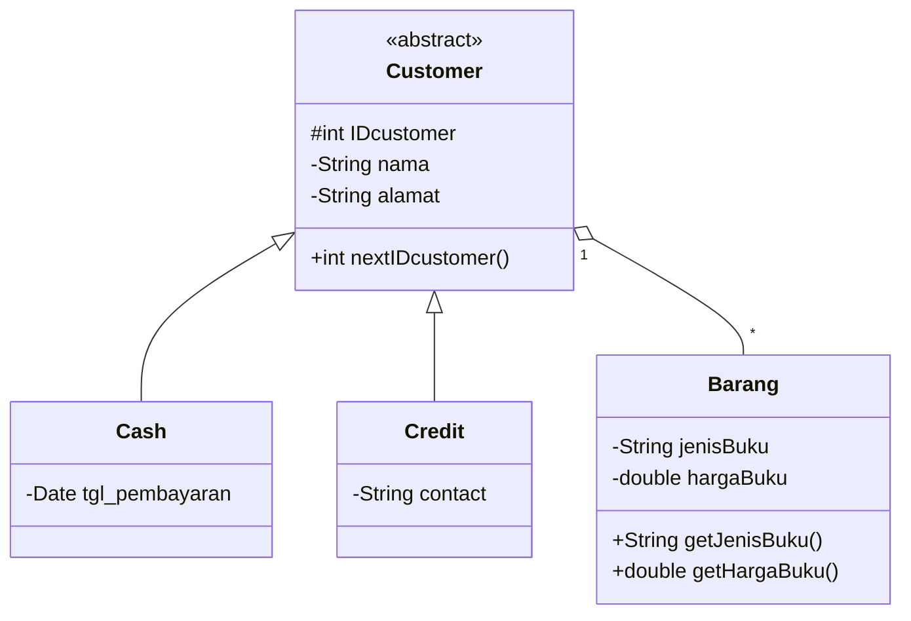
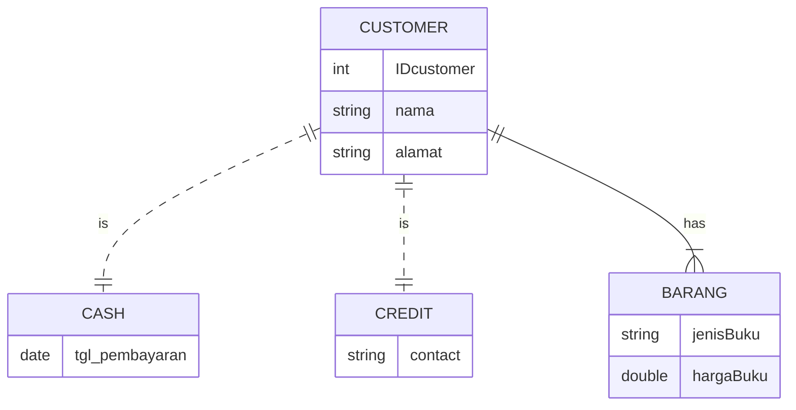
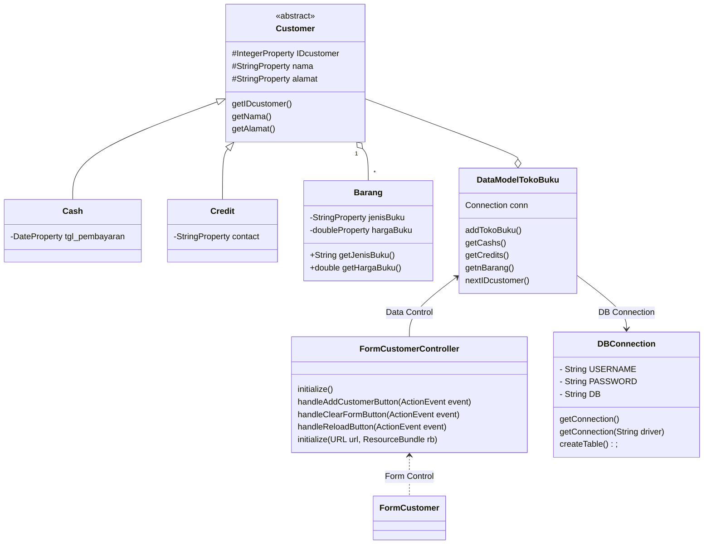

# Nama Anggota:
- Ummu Qaltsum 1917051008 (Menulis Program)
- Maghviraturreimadhiney 1917051021 (Mendesain Diagram)
- Muhammad Faishal Athallah 1917051072 (Mendesain GUI)

###
# Penjelasan Aplikasi Sistem Penjualan Toko Buku "SHEENA"

### Aplikasi ini menyediakan pelayanan untuk melakukan kegiatan transaksi jual-beli pada toko buku
Aplikasi ini juga dapat menjadi bukti pembelian, karena data dari transaksi yang telah dilakukan akan disimpan ke dalam database toko.
Pada Form pengisian data customer, terdapat 5 kolom yang harus diisi, yaitu nama, alamat, tanggal pembayaran, jenis buku, dan harga buku yang dibeli.
Sedangkan, ID customer akan terinisialisasi secara otomatis. ID Customer dapat diperoleh dengan mendaftarkan diri sebagai member atau keanggotaan dari toko buku "Sheena".
- Button Save Data Customer berfungsi untuk menyimpan data yang telah dimasukkan ke dalam database.
- Button Reload Data Table berfungsi untuk menampilkan semua data yang telah dimasukkan.
  (Data-data yang telah dimasukkan tersebut akan tampil pada tabel di sebelah pojok kanan atas)
- Button Clear Form berfungsi untuk mengosongkan kolom pengisian.
- Button Add Barang berfungsi untuk menambahkan data buku yang dibeli oleh pelanggan.

Di sebelah kanan bawah terdapat form untuk menginputkan data buku yang dibeli.
Ketika ada pelanggan yang sama membeli lebih dari satu buku, cukup menekan data pelanggan tersebut pada tabel di sebelah kanan atas,
lalu akan muncul ID pelanggan tersebut di kolom pengisian bagian kanan bawah, kasir hanya perlu mengisikan jenis buku dan harga buku yang ingin ditambahkan.
Kemudian data tersebut akan muncul pada tabel di bagian tengah bawah.

###
### Class Diagram

Terdapat empat buah entitas pada diagram ini, yaitu: Customer, Barang, Cash, dan Credit.

1. Entitas Customer memiliki beberepa atribut:
    - "IDcustomer" yang bertipe data integer sebagai Primary Key
    - "nama" dengan tipe data string
    - "alamat" dengan tipe data string
    Juga memiliki method "nextIDcustomer" bertipe data integer

2. Entitas Barang memiliki beberepa atribut:
    - "jenisBuku" yang bertipe data string
    - "hargaBuku" dengan tipe data double
    Juga memiliki method "getJenisBuku" dan "getHargaBuku" dengan masing-masing tipe data menyesuaikan tipe variabelnya

3. Entitas Cash memiliki sebuah atribut yaitu "tgl_pembayaran" yang bertipe data date
4. Entitas Credit memiliki sebuah atribut yaitu "Contact" yang bertipe data string

Hubungan atau relasi antara entitas Customer dengan Barang adalah aggregation,
dengan ketentuan setiap satu Customer dapat memiliki banyak Barang.
Hubungan atau relasi antara entitas Cash dan Credit dengan Customer adalah inheritance.

###
### Entity Reationship Diagram

Terdapat empat buah entitas pada diagram ini, yaitu: Customer, Barang, Cash, dan Credit.

1. Entitas Customer memiliki beberepa atribut:
    - "IDcustomer" bertipe data integer
    - "nama" bertipe data string
    - "alamat" bertipe data string

2. Entitas Barang memiliki beberepa atribut:
    - "jenisBuku" bertipe data string
    - "hargaBuku" bertipe data double

3. Entitas Cash memiliki sebuah atribut yaitu "tgl_pembayaran" yang bertipe data date
4. Entitas Credit memiliki sebuah atribut yaitu "Contact" yang bertipe data string

Hubungan atau relasi antara entitas Customer dengan Barang adalah tepat satu ke banyak (one to many),
artinya setiap seorang Customer dapat membeli (memiliki) satu atau lebih Barang yang dijual oleh toko.
Hubungan atau relasi antara entitas Cash dan Credit dengan Customer adalah satu ke satu (one to one),
dimana relasi ini berupa pilihan bagi pengguna untuk memilih melakukan pembayaran menggunakan Cash/Credit atau tidak.

###
### Design Class Diagram for JavaFX and Database

Pada desain diagram ini sama seperti diagram-diagram sebelumnya, yaitu: Customer, Barang, Cash, dan Credit. 
Hanya saja ada beberapa tambahan entitas: DataModelTokoBuku, FormCustomerController, DBConnection, dan FormCustomer.

Pada entitas Customer terdapat penambahan method, yaitu: getIDcustomer(), getNama(), dangetAlamat()

1. Entitas DataModelTokoBuku memiliki atribut "Connection conn"
    Juga beberapa memiliki method: addCustomer(), addBarang(), getCash(), getCredit(), dan nextIDcustomer()

2. Entitas FormCustomerController memiliki beberapa method yang berperan sebagai cotroller:
    - initialize()
    - handleAddCustomerButton(ActionEvent event)
    - handleClearFormButton(ActionEvent event)
    - handleReloadButton(ActionEvent event)
    - initialize(URL url, ResourceBundle rb)

3. Entitas DBConnection memiliki beberapa atribut:
    - "USERNAME" bertipe data string
    - "PASSWORD" bertipe data string
    - "DB" bertipe data string
   Juga memiliki beberapa method, yaitu: getConnection(), getConnection(String driver), dan createTable()

4. Entitas FormCustomer 

Hubungan atau relasi antara entitas DataModelTokoBuku dengan Customer adalah aggregation, 
yang berarti toko buku memiliki pelanggan yang berinteraksi dengan sistem pada toko buku.
Hubungan atau relasi antara entitas FormCustomerController dengan DataModelTokoBuku adalah association,
relasi ini memiliki arti bahwa FormCustomerController merupakan bagian dari DataModelTokoBuku yang berperan dalam data control.
Hubungan atau relasi antara entitas DataModelTokoBuku dengan DBConnection adalah association,
relasi ini memiliki arti supaya dapat mengakses DataModelTokoBuku maka dilakukan interaksi dengan DBConnection terlebih dahulu.
Hubungan atau relasi antara entitas FormCustomer dengan FormCustomerController adalah dependency, 
dimana pengoperasian dari FormCustomer bergantung pada FormCustomerController.
